# Entity-Relationship Diagram — Core Material Tracking

This diagram covers the core entities involved in **material traceability**:
from master data (materials, warehouses, suppliers) through engineering
(BOM/Routing), planning & execution (Sales Order → Production Order), to
physical stock movements (StockLedger/StockBalance) and quality/scrap
tracking. It intentionally omits peripheral modules (HR, dispatch, quality
NCR/CAPA, etc.) to keep the "can I trace a KG of steel to a finished part"
story readable.

```mermaid
erDiagram
    SUPPLIER ||--o{ MATERIAL : "supplies (default)"
    CUSTOMER ||--o{ SALES_ORDER : places

    MATERIAL ||--o{ BOM_ITEM : "consumed as"
    MATERIAL ||--|| BOM : "is finished good of"
    MATERIAL ||--|| ROUTING : "is finished good of"
    MATERIAL ||--o{ STOCK_BALANCE : "held as"
    MATERIAL ||--o{ STOCK_LEDGER : "moved as"
    MATERIAL ||--o{ SALES_ORDER_ITEM : "ordered as"
    MATERIAL ||--o{ MATERIAL_ISSUE_LINE : "issued as"
    MATERIAL ||--o{ SCRAP : "scrapped as"

    WAREHOUSE ||--o{ STOCK_BALANCE : holds
    WAREHOUSE ||--o{ STOCK_LEDGER : "movement at"
    WAREHOUSE ||--o{ MATERIAL_ISSUE : "issued from"

    BOM ||--o{ BOM_ITEM : contains
    ROUTING ||--o{ ROUTING_OPERATION : contains
    WORK_CENTER ||--o{ ROUTING_OPERATION : performs
    WORK_CENTER ||--o{ MACHINE : houses
    WORK_CENTER ||--o{ PRODUCTION_ORDER_OPERATION : performs

    SALES_ORDER ||--o{ SALES_ORDER_ITEM : contains
    SALES_ORDER ||--o{ PRODUCTION_ORDER : triggers

    PRODUCTION_ORDER ||--|| BOM : "consumes per"
    PRODUCTION_ORDER ||--|| ROUTING : "follows"
    PRODUCTION_ORDER ||--o{ PRODUCTION_ORDER_OPERATION : contains
    PRODUCTION_ORDER ||--o{ MATERIAL_ISSUE : "receives materials via"
    PRODUCTION_ORDER ||--o{ STOCK_LEDGER : "drives movements in"
    PRODUCTION_ORDER ||--o{ SCRAP : generates

    MACHINE ||--o{ PRODUCTION_ORDER_OPERATION : "used in"
    MACHINE ||--o{ SCRAP : "source of"

    SHIFT ||--o{ SCRAP : "recorded during"
    SHIFT ||--o{ STOCK_LEDGER : "recorded during"

    USER ||--o{ SCRAP : operates
    USER ||--o{ MATERIAL_ISSUE : issues
    USER ||--o{ PRODUCTION_ORDER : creates
    USER }o--|| ROLE : "assigned"

    MATERIAL_ISSUE ||--o{ MATERIAL_ISSUE_LINE : contains
    MATERIAL_ISSUE ||--o{ STOCK_LEDGER : posts

    STOCK_BALANCE {
        ObjectId material FK
        ObjectId warehouse FK
        string rack
        string batchNumber
        string heatNumber
        string lotNumber
        number qty
        number reservedQty
        number unitCost
        number totalValue
    }

    STOCK_LEDGER {
        ObjectId material FK
        ObjectId warehouse FK
        string voucherType
        string voucherNumber
        ObjectId voucherId
        string txnType "IN or OUT"
        number qtyIn
        number qtyOut
        number balanceQty
        number unitCost
        ObjectId productionOrder FK
    }

    MATERIAL {
        string code PK
        string name
        string type "raw/semi/finished/consumable/scrap/tooling"
        string uom
        string valuationMethod "FIFO/Average"
        number standardCost
        number averageCost
        boolean isBatchTracked
        boolean isHeatNumberTracked
    }

    WAREHOUSE {
        string code PK
        string name
        string type "RM/FG/Scrap/WIP/..."
        array racks
    }

    BOM {
        ObjectId finishedMaterial FK
        string version
        number baseQty
        string status
    }

    BOM_ITEM {
        ObjectId material FK
        number qty
        string uom
        number scrapPercent
    }

    ROUTING {
        ObjectId finishedMaterial FK
        string version
        string status
    }

    ROUTING_OPERATION {
        number seq
        string operationName
        string processType
        ObjectId workCenter FK
        number setupTime
        number runTimePerUnit
    }

    SALES_ORDER {
        string soNumber PK
        ObjectId customer FK
        string status
        number totalAmount
    }

    SALES_ORDER_ITEM {
        ObjectId material FK
        number qty
        number unitPrice
        number amount
    }

    PRODUCTION_ORDER {
        string orderNumber PK
        ObjectId salesOrder FK
        ObjectId material FK
        ObjectId bom FK
        ObjectId routing FK
        number qty
        string status
        object materialSummary
    }

    PRODUCTION_ORDER_OPERATION {
        number seq
        string operationName
        ObjectId workCenter FK
        ObjectId machine FK
        string status
        number qtyCompleted
        number scrapQty
    }

    MATERIAL_ISSUE {
        string issueNumber PK
        ObjectId productionOrder FK
        ObjectId warehouse FK
        string status
    }

    MATERIAL_ISSUE_LINE {
        ObjectId material FK
        string batchNumber
        string heatNumber
        number qty
        number unitCost
    }

    SCRAP {
        string scrapNumber PK
        ObjectId productionOrder FK
        ObjectId material FK
        ObjectId recoveredMaterial FK
        string scrapType
        number recoveredQty
        string status
    }

    CUSTOMER {
        string code PK
        string name
        string customerType
    }

    SUPPLIER {
        string code PK
        string name
        string supplierType
    }

    WORK_CENTER {
        string code PK
        string name
        string department
    }

    MACHINE {
        string code PK
        string name
        string category
        ObjectId workCenter FK
    }

    SHIFT {
        string code PK
        string startTime
        string endTime
    }

    USER {
        string employeeCode PK
        string email
        string role
    }

    ROLE {
        string name PK
        array permissions
    }
```

## Traceability walk-through

The diagram enables the core manufacturing traceability question — *"which
batch/heat of raw material ended up in which finished part, and how much
was scrapped along the way?"* — to be answered by following:

1. **`SalesOrder`** → **`ProductionOrder`** (via `salesOrder` ref) — what was ordered vs. what is being made.
2. **`ProductionOrder`** → **`BOM`** / **`Routing`** — what materials and operations are required.
3. **`ProductionOrder`** → **`MaterialIssue`** → **`MaterialIssueLine`** — which batch/heat of raw material was issued to the shop floor.
4. **`MaterialIssue`** → **`StockLedger`** (`voucherType: MaterialIssue`) — the immutable stock movement record (source of truth).
5. **`StockLedger`** → **`StockBalance`** — the current on-hand quantity per material/warehouse/batch/heat "bucket".
6. **`ProductionOrder`** → **`Scrap`** — turning/process scrap generated per operation, optionally recovered into a `Material` of `type: scrap` (e.g. `SCRAP-MS-TURNING`) for resale.

This is exactly the flow exercised by `backend/src/seeds/index.ts`.
